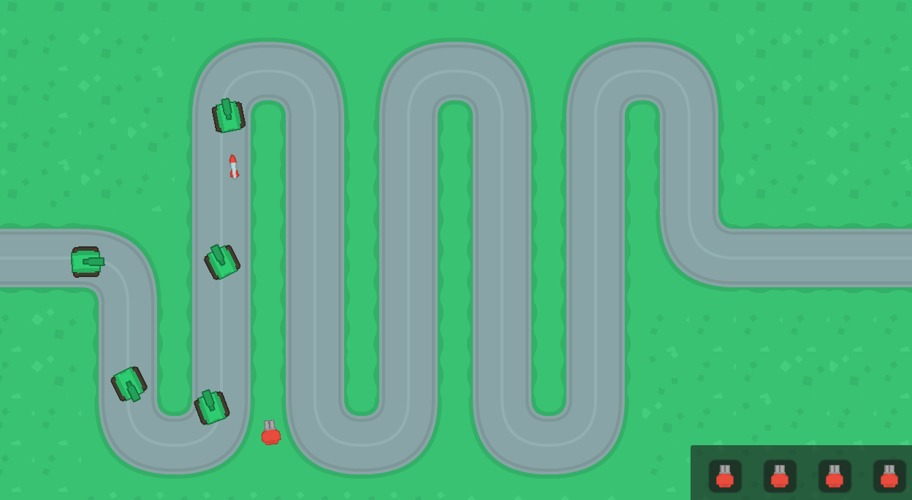

# Game Project

This document will provide an overview of the resources used and features included in the game.

## Table of Contents

1. [Asset Packs Used](#asset-packs-used)
2. [Game Modes](#game-modes)
3. [Rationale](#rationale)
4. [Known Issues](#known-issues)

## Asset Packs Used

Asset packs used:

1. [Top-Down Tanks Redux](https://kenney.nl/assets/top-down-tanks-redux)
2. [Tower Defense Top-Down](https://kenney.nl/assets/tower-defense-top-down)

## Game Modes

The game currently includes three scene modes:

1. **Main Menu:** This is the starting point of the game. From here, you can navigate to different features of the game.
2. **Main (Game):** This is where the gameplay takes place. Fight enemies, collect items, and try to survive as long as you can!
3. **Game Over Scene:** When your game ends, you'll be directed to this scene. You can view your score here and decide whether to try again or quit.

## Rationale

This project utilizes the Godot Engine written in C++ for our game development. Godot employs an intuitive tree-like node system that greatly facilitates the development process. Each game object is a node, and nodes can have other nodes as children, which makes for an easy-to-understand hierarchical system.

In Godot, each node comes with a set of functionalities that can be expanded with scripts. This enables the quick use of global variables such as cursor XY position, and position / rotation of sprites. For more information on how Godot works, see the [official Godot documentation](https://docs.godotengine.org/en/stable/).

### Script Explanations:
A brief explanation of how it works:

1. `Bullet.gd`: This script controls the behavior of bullets in the game. The bullets target the enemy tank and move towards it. When a bullet hits the tank, it reduces the health of the tank【13†source】.

2. `BulletTower.gd`: This script controls the bullet towers in the game. These towers track the position of the tank and shoot bullets at it. The script manages which tank to target based on the tank's progress【19†source】.

3. `PathSpawner.gd`: This script seems to be responsible for spawning the paths the tanks follow. It instantiates a new path when a timer times out【25†source】.

4. `BulletTowerPanel.gd`: This script is responsible for managing the tower picker GUI. It controls the placement and removal of towers in the game scene. The towers can be moved and placed in the game scene with mouse inputs【31†source】.

5. `Failure_scene.gd`: This script controls the game over scene. It allows the player to try again, quit the game, or return to the main menu【37†source】.

6. `Menu.gd`: This script controls the main menu of the game. It enables the player to start the game or quit【43†source】.

## Known Issues

There are a few known issues:

- **Inordinate amount of projectiles spawn when multiple enemies on screen:** 
- **Projectiles left lingering if spawned too quickly:** 

Hope you enjoy playing our game as much as I did creating it. Happy gaming!

